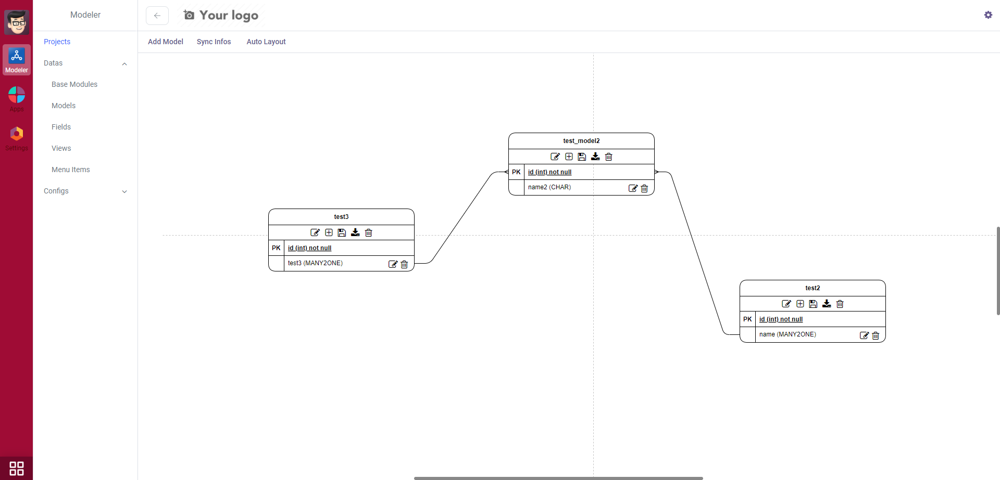
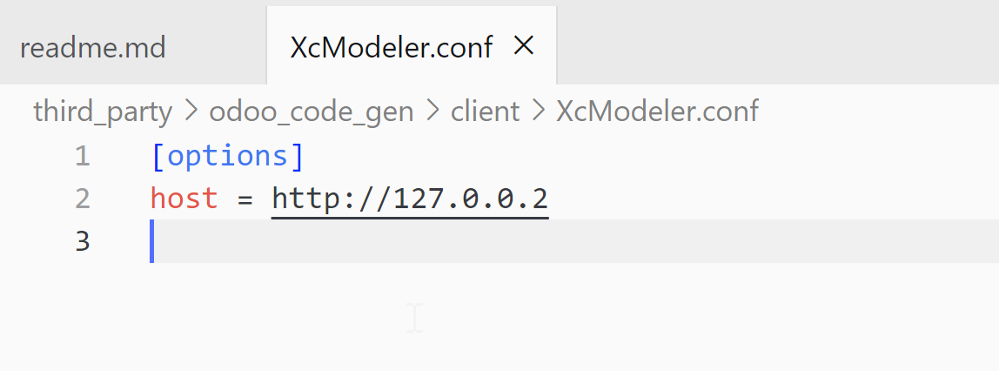

# Code Gernerator For Odoo
This is a modeler and code gernerator for odoo.

# How To Use
1.install the backend module

2.download the modeler client. set the backend address in the XcModeler.conf
[download](https://www.openerpnext.com/@/modeler-and-code-generator-for-odoo)

**Notice**
this modeler depends on the awesome_theme, you can remove it form the depends module list.
you can visit this address to get the module 
[download](https://apps.odoo.com/apps/themes/17.0/awesome_theme/) from this address. visit our website for more detail [docs](https://www.openerpnext.com/@/modeler-and-code-generator-for-odoo) 
